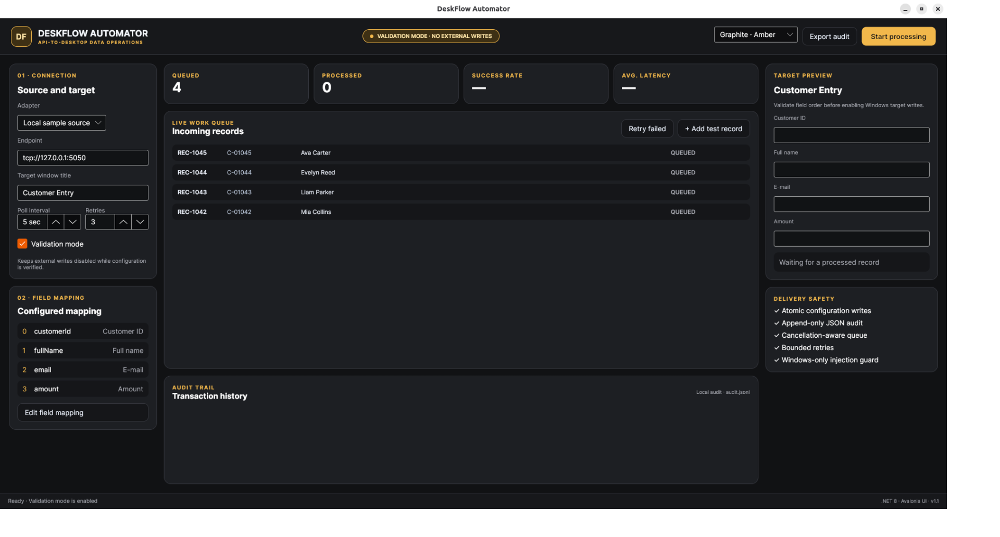
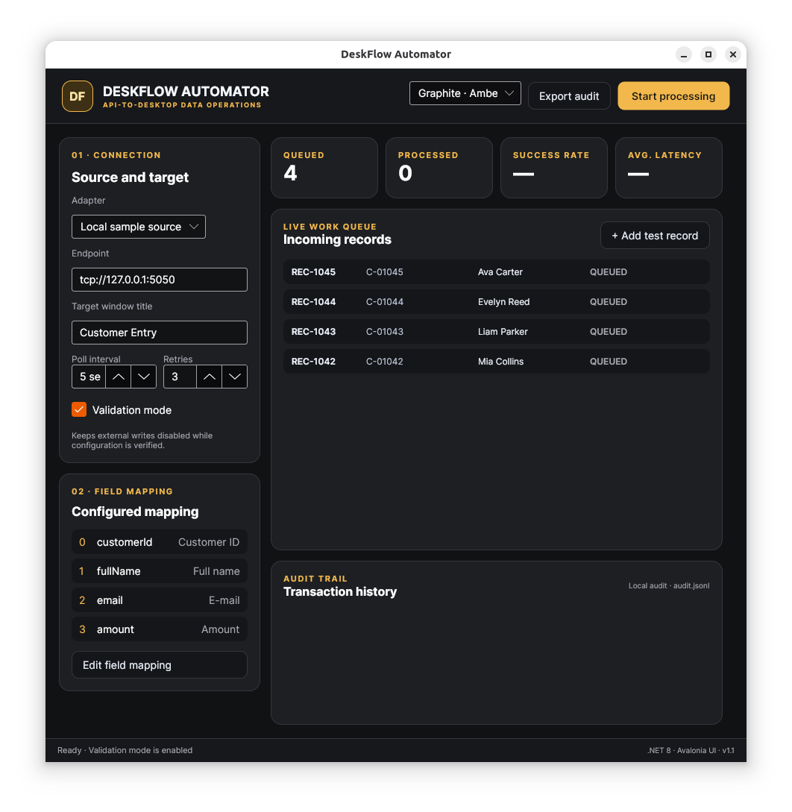

# DeskFlow Automator

DeskFlow is a Windows data-entry automation project built around a simple rule:
incoming records must be traceable, repeatable and safe to retry.



## What it demonstrates

- configurable record source and field mapping;
- cancellation-aware queue processing;
- validation before a target receives any input;
- bounded retries with useful failure messages;
- record-ID idempotency to prevent duplicate writes;
- append-only audit history;
- five color palettes and responsive full/half-screen layouts.

## Technology

- C# and .NET 8 for the processing core;
- Avalonia UI for the cross-platform desktop shell;
- Windows UI Automation as the preferred production target;
- guarded `SendInput` as a compatibility fallback;
- JSON configuration and JSON Lines audit records.

## Source included here

The `src` directory contains a buildable review of the contracts, mapping,
validation, retry and theme logic. Customer-specific protocol code, control
selectors and deployment files are private by design. See
[PUBLIC_SOURCE_SCOPE.md](PUBLIC_SOURCE_SCOPE.md).

```bash
dotnet build
```

## Interface behavior

At desktop width the target preview stays visible. In a half-screen window the
secondary preview collapses and the queue remains usable; at narrow widths the
main work area takes priority. Settings panels scroll independently instead of
being clipped.



## Ownership

Copyright © 2026 Muhammet Sait Doğmuş. This is a portfolio source release; see
[LICENSE](LICENSE) before using any part of it.
